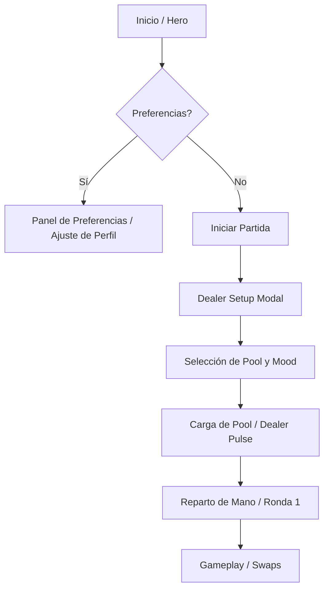

# 🎨 Reporte de Diseño: Movie Dealer v1.0 "Deep Discovery"

**Versión:** 1.0  
**Fecha:** 17 de febrero de 2026  
**Estado:** Propuesta de Implementación UI/UX

---

## 1. Visión Estética y Fundamentos
El diseño de **Movie Dealer** evoluciona hacia una estética de "High Stakes Noir". Se mantiene el **Glassmorphism** como eje central, pero se introducen elementos dinámicos que refuerzan la sensación de estar en una mesa de juego de alta tecnología.

- **Atmósfera:** Oscura, minimalista, con acentos de luz vibrantes (Neón Rojo/Blanco).
- **Materialidad:** Superficies translúcidas con desenfoque de fondo (backdrop-filter: blur(20px)).
- **Sensación:** Precisión algorítmica y descubrimiento cinemático.

---

## 2. Wireframes y Nuevas Pantallas

### 2.1 Pantalla de Personalización (Dealer Setup)
Esta pantalla es un modal de alto impacto que aparece antes de iniciar el reparto.

| Elemento | Descripción Visual | Comportamiento |
| :--- | :--- | :--- |
| **Slider de Pool** | Barra horizontal de color rojo neón con ticks marcados. | Valores discretos: **60** (Rápido), **120** (Equilibrado), **200** (Deep Discovery). |
| **Mood Selector** | Tres tarjetas de cristal con iconos minimalistas. | Toggle único. Al seleccionar uno, los otros se atenúan. |
| **Botón Reset** | Icono de flecha circular en el borde inferior. | Borra `seenMovieIds` y `preferences` del localStorage con una animación de "limpieza". |

**Layout Propuesto (ASCII):**
```text
+------------------------------------------+
|            DEALER SETTINGS [X]           |
+------------------------------------------+
|  POOL SIZE: [ 60 | 120 | (200) ]         |
|  <----------[==O]----------------------> |
|  "Discovery profundo: +200 películas"    |
+------------------------------------------+
|  MOOD MODE:                              |
|  [ ADVENTURE ]  [ CHILL ]  [ PURIST ]    |
|       (i)           (i)         (i)      |
+------------------------------------------+
| [ RESET PROFILE DATA ]                   |
+------------------------------------------+
|           [ DEAL CARDS ]                 |
+------------------------------------------+
```

### 2.2 Panel de Preferencias (Sidebar)
Accesible desde el "Inicio" para ajustar el perfil antes de entrar al juego.
- **Visual:** Panel lateral derecho con fondo `rgba(0,0,0,0.8)` y desenfoque masivo.
- **Contenido:** Historial de géneros vetados, décadas preferidas y estadísticas de "Dealer Burns".

---

## 3. Especificaciones de Interacción

### 3.1 Comportamiento del Slider
- **Tipo:** Valores discretos (Discrete).
- **Lógica:** Cada punto representa una cantidad de páginas de TMDB a consultar (3, 6, 10 páginas).
- **Feedback:** Al deslizar, el texto debajo del slider cambia dinámicamente:
    - *60:* "Partida rápida, hits garantizados."
    - *120:* "Exploración equilibrada."
    - *200:* "Experiencia cinematográfica total (requiere carga)."

### 3.2 Tooltips Explicativos (Mood Modes)
| Modo | Tooltip Text | Efecto Algorítmico |
| :--- | :--- | :--- |
| **Aventura** | "El Dealer prioriza la sorpresa sobre tus gustos conocidos. Ideal para salir de la zona de confort." | Reduce el peso de `preferences` en el swap un 50%. |
| **Chill** | "Relájate con títulos populares y fáciles de disfrutar según tu perfil." | Aumenta el filtro de popularidad y vote_count. |
| **Purista** | "Cine de culto, clásicos y joyas críticas. Sin ruido comercial." | Filtra por vote_average > 8.0 y pre-2000. |

### 3.3 Indicadores de Carga (Massive Pool)
Para el modo de 200 películas, se implementa un **"Dealer Pulse"**:
- El mazo de cartas en el centro de la pantalla emite un resplandor rojo que pulsa al ritmo de las peticiones paralelas.
- **Barra de Progreso:** Un hilo fino de 2px de alto en la parte superior del header que se llena de 0 a 100% según las páginas recibidas.

---

## 4. Estilos Visuales

### 4.1 Colores
- **Background:** `#050505` (Noir Puro)
- **Primary:** `#FFFFFF` (Claridad)
- **Accent:** `#FF0015` (Peligro/Dealer)
- **Glass:** `rgba(255, 255, 255, 0.03)` con borde `0.1` de opacidad.

### 4.2 Tipografía
- **Display:** *Syne* (Negrita Extrema) para títulos y sliders.
- **Main:** *Outfit* para cuerpo y controles.
- **Mono:** *JetBrains Mono* para datos técnicos y carga.

### 4.3 Iconografía (Mood)
- **Aventura:** Brújula o Dado.
- **Chill:** Bebida de cine o Sofá.
- **Purista:** Rollo de película clásica o Pluma.

---

## 5. Flujo de Usuario



---

## 6. Animaciones de Transición
1. **Mode Switch:** Al cambiar de Mood, las tarjetas de la mano actual deben hacer un "re-flip" rápido para indicar que el criterio de reemplazo ha cambiado.
2. **Modal Entry:** Fade-in con escala de 0.95 a 1.0 para dar sensación de profundidad.
3. **Burn Animation:** Cuando el Dealer elimina la carta más baja (Round 2), la carta debe desintegrarse en partículas rojas.

---
*Fin del Reporte de Diseño v1.0*
